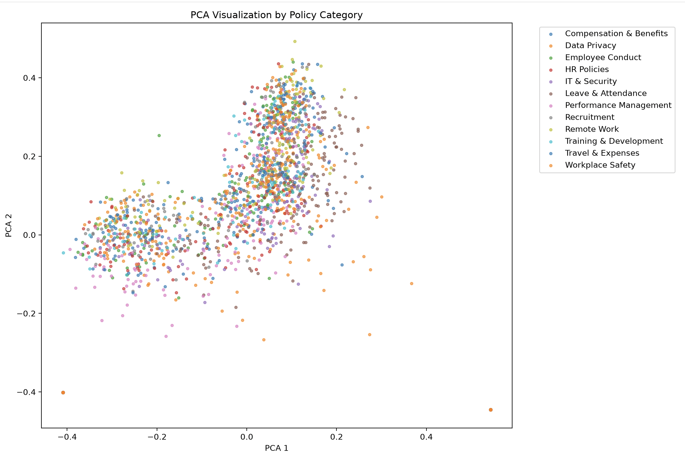
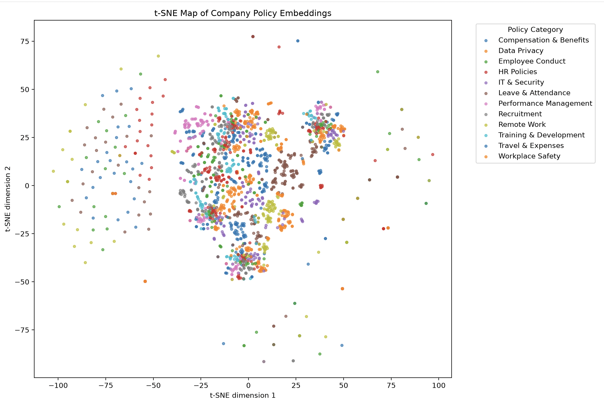
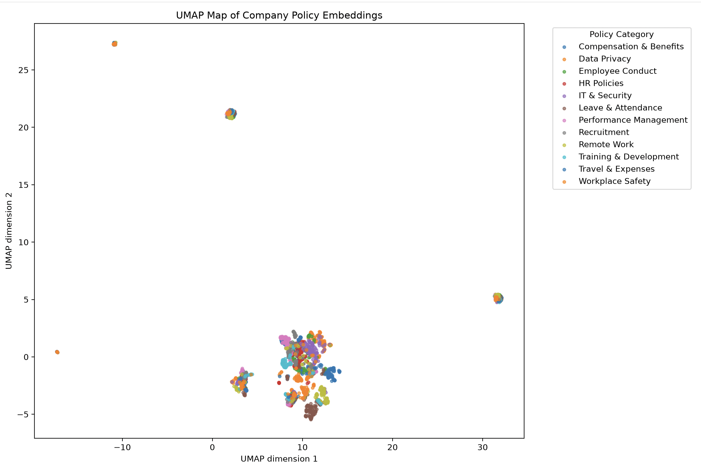

# RAG-Based Company Policy 

## Complete Project Report

---

# 1. Project Overview

## 1.1 Project Title

**RAG-Based Company Policy**

## 1.2 Project Type

Retrieval-Augmented Generation (RAG) / Semantic Search / Information Retrieval System

## 1.3 Project Objective

The objective of this project was to build a searchable knowledge system for company HR and workplace policies.

The system takes a collection of company policy documents, processes them into searchable chunks, converts the chunks into numerical embeddings, stores those embeddings in a vector database, and provides multiple retrieval strategies for finding relevant policy information.

The project implements:

- Document ingestion
- Document processing
- Text chunking
- Text embeddings
- Vector database storage
- Metadata handling and filtering
- Keyword search using BM25
- Semantic/vector search
- Hybrid search
- Query rewriting
- Content retrieval
- Retrieval evaluation
- FastAPI endpoints
- Embedding visualization
- Dimensionality-reduction analysis
- Clustering and outlier analysis

The project was developed incrementally through **18 implementation phases**, starting from project setup and ending with embedding-space visualization and analysis.

---

# 2. Problem Statement

Organizations commonly store important information in documents such as:

- HR policies
- Leave policies
- Compensation policies
- Remote-work policies
- Employee conduct policies
- Security policies
- Recruitment policies
- Travel policies
- Training policies

Traditional keyword search can struggle when users ask questions using different wording from the documents.

For example:

> "Am I allowed to work remotely?"

The relevant document might use terminology such as:

> "work-from-home eligibility"

A keyword-only system may have difficulty connecting the two expressions.

A semantic retrieval system instead represents text as vectors so that texts with related meanings can be retrieved even when their exact words differ.

Therefore, this project explores and implements multiple retrieval approaches:

```text
Keyword Search
      +
Semantic Search
      +
Hybrid Retrieval
      ↓
Relevant Policy Information
````

---

# 3. Project Goals

The main goals of the project were:

1. Build a complete document-processing pipeline.
2. Convert policy documents into meaningful chunks.
3. Generate embeddings for the chunks.
4. Store embeddings in a vector database.
5. Implement semantic vector search.
6. Implement traditional keyword search.
7. Implement hybrid retrieval.
8. Support metadata-based filtering.
9. Implement query rewriting.
10. Provide content retrieval functionality.
11. Expose the system through FastAPI.
12. Compare retrieval methods using evaluation metrics.
13. Analyze embedding structure visually.
14. Understand the strengths and weaknesses of different retrieval approaches.

---

# 4. Dataset

## 4.1 Dataset Description

The project uses a synthetic company-policy dataset designed for an HR/company knowledge-base RAG system.

The dataset contains:

**250 documents**

Each document contains structured metadata together with policy content.

---

## 4.2 Dataset Fields

The first document contains the following fields:

```text
document_id
title
category
subcategory
department
source
source_type
version
status
effective_date
last_updated
review_cycle
language
audience
keywords
aliases
chunk_hints
common_questions
content
topics
entities
policy_type
approval_roles
related_policies
```

This structure is useful for RAG because the system has access to both:

* unstructured policy content
* structured metadata

The metadata can later be used to restrict retrieval.

---

## 4.3 Dataset Categories

| Category                | Documents |
| ----------------------- | --------: |
| HR Policies             |        25 |
| Leave & Attendance      |        25 |
| Compensation & Benefits |        25 |
| Employee Conduct        |        20 |
| Remote Work             |        20 |
| Recruitment             |        20 |
| Performance Management  |        20 |
| Workplace Safety        |        20 |
| IT & Security           |        20 |
| Data Privacy            |        25 |
| Travel & Expenses       |        15 |
| Training & Development  |        15 |
| **Total**               |   **250** |

---

## 4.4 Departments

| Department               | Documents |
| ------------------------ | --------: |
| Human Resources          |       115 |
| People Operations        |        40 |
| Workplace Safety         |        20 |
| Information Technology   |        20 |
| Information Governance   |        25 |
| Finance & Administration |        15 |
| Learning & Development   |        15 |

---

## 4.5 Dataset Quality Inspection

The dataset was inspected before being used in the RAG pipeline.

### Document statistics

| Property                 |           Result |
| ------------------------ | ---------------: |
| Total documents          |              250 |
| Minimum content length   | 2,711 characters |
| Maximum content length   | 3,375 characters |
| Average content length   | 3,146 characters |
| Minimum keywords         |               18 |
| Maximum keywords         |               18 |
| Average keywords         |               18 |
| Minimum common questions |                7 |
| Maximum common questions |                7 |
| Average common questions |                7 |

### Data quality

| Check                    | Result |
| ------------------------ | -----: |
| Duplicate document IDs   |   None |
| Missing document IDs     |      0 |
| Missing titles           |      0 |
| Missing categories       |      0 |
| Missing content          |      0 |
| Missing keywords         |      0 |
| Missing aliases          |      0 |
| Missing topics           |      0 |
| Missing entities         |      0 |
| Missing common questions |      0 |
| Active documents         |    250 |
| English documents        |    250 |

### Dataset suitability

The dataset was considered suitable for a RAG project because:

* documents contain substantial policy content
* documents have useful metadata
* multiple policy categories are represented
* documents contain keywords and aliases
* documents contain common questions
* the dataset contains no duplicate document IDs
* required fields are complete
* the dataset provides enough variety to test semantic and keyword retrieval

---

# 5. System Architecture

The final system follows this overall architecture:

```text
                  Company Policy Dataset
                           │
                           ▼
                  Document Ingestion
                           │
                           ▼
                  Document Processing
                           │
                           ▼
                       Chunking
                           │
                           ▼
                     Embeddings
                           │
                           ▼
                     ChromaDB
                           │
             ┌─────────────┴─────────────┐
             │                           │
             ▼                           ▼
       Vector Search                Keyword Search
             │                           │
             └─────────────┬─────────────┘
                           ▼
                    Hybrid Search
                           │
                           ▼
                    Query Rewriting
                           │
                           ▼
                   Content Retrieval
                           │
                           ▼
                       FastAPI
                           │
                           ▼
                       User/API
```

The project also contains separate evaluation and visualization pipelines:

```text
Embeddings
    │
    ├── PCA
    ├── t-SNE
    ├── UMAP
    ├── K-Means / clustering analysis
    └── Outlier analysis
```

---

# 6. Technology Stack

| Component                | Technology                   |
| ------------------------ | ---------------------------- |
| Programming Language     | Python                       |
| Data Processing          | NumPy, Pandas                |
| Machine Learning         | Scikit-learn                 |
| Embeddings               | Sentence Transformers        |
| Vector Database          | ChromaDB                     |
| Keyword Retrieval        | BM25                         |
| API Framework            | FastAPI                      |
| ASGI Server              | Uvicorn                      |
| Visualization            | Matplotlib                   |
| Dimensionality Reduction | PCA, t-SNE, UMAP             |
| Clustering               | K-Means / embedding analysis |
| Environment              | Python virtual environment   |

---

# 7. Project Structure

The final project contains the following major structure:

```text
RAG project/
│
├── Project report.md
├── prompt.md
├── requirements.txt
│
├── data/
│   ├── chroma/
│   ├── vector_db/
│   ├── raw/
│   │   └── company_policies_rag_10_10_FINAL(1).json
│   │
│   ├── processed/
│   │   ├── documents.json
│   │   ├── chunks.json
│   │   ├── embeddings.json
│   │   ├── visualization_embeddings.npy
│   │   ├── visualization_metadata.json
│   │   └── visualization_results.json
│   │
│   ├── vector_search_results.json
│   ├── hybrid_search_results.json
│   ├── retrieval_comparison.json
│   └── retrieval_metrics.json
│
└── src/
    │
    ├── dataset_inspection.py
    │
    ├── ingestion/
    │   └── ingestion.py
    │
    ├── chunking/
    │   ├── chunker.py
    │   └── validate_chunks.py
    │
    ├── embeddings/
    │   ├── embed_chunks.py
    │   └── embedding_experiment.py
    │
    ├── vector_store/
    │   └── chroma_store.py
    │
    ├── metadata/
    │   ├── inspect_metadata.py
    │   └── test_metadata_filter.py
    │
    ├── search/
    │   ├── keyword_search.py
    │   ├── vector_search.py
    │   └── hybrid_search.py
    │
    ├── query/
    │   ├── query_rewriter.py
    │   └── test_query_rewriter.py
    │
    ├── retrieval/
    │   ├── rag_retrieval.py
    │   └── content_retrieval.py
    │
    ├── evaluation/
    │   ├── metrics.py
    │   ├── evaluation_data.py
    │   ├── evaluation_queries.py
    │   ├── find_ground_truth.py
    │   ├── evaluate_retrieval.py
    │   ├── evaluate_vector_search.py
    │   ├── evaluate_hybrid_search.py
    │   ├── evaluate_metrics.py
    │   ├── compare_retrieval.py
    │   └── test_metrics.py
    │
    ├── visualization/
    │   ├── inspect_embeddings.py
    │   ├── prepare_visualization_data.py
    │   ├── pca_visualization.py
    │   ├── tsne_visualization.py
    │   ├── umap_visualization.py
    │   ├── compare_dimensionality_reduction.py
    │   ├── analyze_embedding_structure.py
    │   └── save_visualization_results.py
    │
    └── api/
        ├── main.py
        └── schemas.py
```

The project is organized according to responsibility rather than putting the entire RAG pipeline into one script.

---

# 8. Phase-by-Phase Implementation

# Phase 1 — Folder Structure

The first step was creating a modular project structure.

The purpose was to separate:

* ingestion
* chunking
* embeddings
* vector storage
* search
* retrieval
* evaluation
* visualization
* API

This makes the project easier to understand, test, maintain, and extend.

---

# Phase 2 — Virtual Environment

A Python virtual environment was created so that project dependencies remain isolated from the system Python installation.

The environment was activated using:

```bash
source .venv/bin/activate
```

The terminal then displayed:

```text
(.venv)
```

indicating that the virtual environment was active.

---

# Phase 3 — Dependencies

The project uses the following dependencies:

```text
numpy
pandas
scikit-learn
sentence-transformers
chromadb
fastapi
uvicorn
matplotlib
```

The dependencies can be installed using:

```bash
pip install -r requirements.txt
```

---

# Phase 4 — Installation Verification

The installed environment was verified by running project components and confirming that the required packages and scripts executed successfully.

The project successfully ran with Python 3.14 in the configured environment.

---

# Phase 5 — Dataset Observation

Before implementing retrieval, the dataset was inspected.

The inspection verified:

* document count
* document IDs
* available metadata
* categories
* departments
* status
* language
* content lengths
* keyword availability
* common questions
* missing values
* duplicate IDs

The inspection showed that all 250 documents were active and written in English.

No duplicate document IDs or missing critical fields were found.

Therefore, the dataset was suitable for the intended RAG/search system.

---

# Phase 6 — Document Ingestion

The raw JSON dataset is stored at:

```text
data/raw/company_policies_rag_10_10_FINAL(1).json
```

The ingestion stage loads the source documents and prepares them for downstream processing.

The processed document representation is stored at:

```text
data/processed/documents.json
```

The purpose of this stage is to establish a clean and consistent representation of the original documents before chunking.

---

# Phase 7 — Chunking

Long documents are not normally passed directly into an embedding model.

Instead, each document is divided into smaller chunks.

The project experimented with different chunking strategies before selecting an appropriate baseline.

The final chunking configuration used:

```text
Chunk size: 2000 characters
Overlap:    400 characters
```

The overlap helps preserve context between neighboring chunks.

The resulting chunks were stored in:

```text
data/processed/chunks.json
```

The complete processing pipeline produced:

```text
88,087 chunks
```

The resulting chunks had:

```text
Average chunk size: approximately 1,741 characters
Maximum chunk size: 2,000 characters
```

The chunk validation script was used to inspect and verify the generated chunks.

---

# Phase 8 — Embeddings

The next stage converts text into numerical vectors.

Conceptually:

```text
Policy text
    ↓
Embedding model
    ↓
Numerical vector
```

The project uses a Sentence Transformers embedding model.

The selected model produces:

```text
384-dimensional embeddings
```

Therefore, a single text chunk is represented approximately as:

```text
[
    0.12,
   -0.43,
    0.81,
    ...
]
```

The numbers themselves do not represent individual words.

Together, the dimensions form a learned representation of the semantic characteristics of the text.

The embedding output was stored in:

```text
data/processed/embeddings.json
```

Visualization-specific embedding data was also prepared and stored in:

```text
data/processed/visualization_embeddings.npy
```

---

# Phase 9 — ChromaDB

ChromaDB was introduced to store and search the embeddings efficiently.

The vector database stores information such as:

```text
Document chunk
      +
Embedding
      +
Metadata
```

The project contains ChromaDB storage under:

```text
data/chroma/
```

and:

```text
data/vector_db/
```

The vector database allows semantic queries to retrieve chunks whose embeddings are closest to the query embedding.

---

# Phase 10 — Metadata

Metadata was retained alongside the document chunks.

Important metadata fields include:

* document ID
* title
* category
* subcategory
* department
* source
* status
* effective date
* language
* audience
* keywords
* topics
* entities
* policy type

Metadata is useful because retrieval does not always need to search the entire knowledge base.

For example, a search can conceptually be restricted to:

```text
category = Remote Work
```

before performing semantic retrieval.

The metadata implementation was tested using:

```text
src/metadata/test_metadata_filter.py
```

---

# Phase 11 — Keyword Search

A keyword-based retrieval system was implemented using BM25.

BM25 is a lexical retrieval method.

It focuses primarily on whether important terms in the query appear in candidate documents.

For example:

```text
Query:
"employee emergency contact"
```

A keyword system looks for documents containing related terms such as:

```text
employee
emergency
contact
```

Keyword search is particularly useful when:

* exact terminology matters
* names or policy terms are important
* the query contains specific words
* semantic similarity is not enough

The implementation is located at:

```text
src/search/keyword_search.py
```

---

# Phase 12 — Vector Search

Vector search uses embeddings rather than exact word matching.

The process is:

```text
User query
    ↓
Query embedding
    ↓
Compare against document embeddings
    ↓
Find nearest vectors
    ↓
Return most similar chunks
```

The implementation is located at:

```text
src/search/vector_search.py
```

Vector search is useful when the query and document use different wording but express related concepts.

---

# Phase 13 — Hybrid Search

The project combines keyword and semantic retrieval.

Conceptually:

```text
                 Query
                   │
          ┌────────┴────────┐
          ▼                 ▼
     BM25 Search       Vector Search
          │                 │
          └────────┬────────┘
                   ▼
             Score Fusion
                   │
                   ▼
             Final Ranking
```

The hybrid implementation is located at:

```text
src/search/hybrid_search.py
```

The hybrid approach attempts to combine the strengths of:

* lexical retrieval
* semantic retrieval

The final evaluation, however, showed an important engineering result:

> Combining retrieval methods does not automatically guarantee better performance.

This is discussed in detail in the evaluation section.

---

# Phase 14 — Query Rewriting

A query rewriting component was implemented to improve user queries before retrieval.

The conceptual pipeline is:

```text
Original user query
        ↓
Query rewriting
        ↓
Improved retrieval query
        ↓
Search
```

For example, a short or ambiguous user query can potentially be rewritten into a more retrieval-friendly form.

The implementation is located at:

```text
src/query/query_rewriter.py
```

Tests were created in:

```text
src/query/test_query_rewriter.py
```

**Implementation-specific configuration:**

The exact rewriting model/configuration should be documented here after confirming the final implementation.

---

# Phase 15 — Content Retrieval

After identifying relevant chunks, the project includes a content-retrieval layer.

The purpose is to separate:

```text
Finding relevant chunks
```

from:

```text
Retrieving/organizing their actual content
```

The implementation is located at:

```text
src/retrieval/content_retrieval.py
```

The broader RAG retrieval logic is implemented in:

```text
src/retrieval/rag_retrieval.py
```

---

# Phase 16 — FastAPI

A FastAPI interface was created so that the retrieval system can be accessed through HTTP rather than only through Python scripts.

The API is implemented in:

```text
src/api/main.py
```

Schemas are defined in:

```text
src/api/schemas.py
```

The API can be started with:

```bash
uvicorn src.api.main:app --reload
```

After starting the server, FastAPI provides its interactive API documentation.

The currently implemented endpoints are:

| Method | Endpoint  | Purpose                 |
| ------ | --------- | ----------------------- |
| GET    | `/health` | Check API/system health |
| POST   | `/search` | Submit a search query   |

The exact request and response examples can be added to the API section once the final `/docs` schema is captured.

---

# 9. Retrieval Evaluation

A major part of the project was evaluating retrieval quality rather than simply assuming that the search system worked.

The evaluation used:

```text
15 queries
Top K = 5
```

The metrics calculated were:

* Precision@5
* Recall@5
* F1@5
* Hit Rate@5
* MRR@5

---

# 10. Overall Retrieval Results

## 10.1 Overall Metrics

| Metric      | Keyword |     Vector |     Hybrid |
| ----------- | ------: | ---------: | ---------: |
| Precision@5 |  0.2933 | **0.3333** |     0.3067 |
| Recall@5    |  0.1630 | **0.1852** |     0.1704 |
| F1@5        |  0.2095 | **0.2381** |     0.2190 |
| Hit Rate@5  |  0.6667 |     0.7333 | **0.8000** |
| MRR@5       |  0.5778 |     0.6500 | **0.6833** |

---

# 11. Interpretation of Overall Results

The results show that the three retrieval methods behave differently.

### Vector Search

Vector search achieved the strongest:

* Precision@5
* Recall@5
* F1@5

This indicates that the semantic representation was effective at retrieving relevant chunks for many queries.

### Hybrid Search

Hybrid search achieved the strongest:

* Hit Rate@5
* MRR@5

This is significant because:

**Hit Rate@5 = 0.8000**

means that the hybrid system was able to place at least one relevant result within the top five results for more queries than either individual method.

Similarly, the highest MRR indicates that relevant results tended to appear relatively high in the ranking.

However, hybrid search did **not** achieve the highest F1 score.

This demonstrates an important retrieval-engineering lesson:

> A hybrid system is not automatically better on every metric simply because it combines multiple retrieval strategies.

The way scores are normalized, weighted, and fused can significantly affect the final ranking.

---

# 12. Query-by-Query Comparison

The project evaluated 15 queries individually.

|  # | Query Type  | Best Method |
| -: | ----------- | ----------- |
|  1 | Exact       | Vector      |
|  2 | Exact       | Keyword     |
|  3 | Exact       | Vector      |
|  4 | Exact       | Vector      |
|  5 | General     | Vector      |
|  6 | Semantic    | Keyword     |
|  7 | Semantic    | Keyword     |
|  8 | Semantic    | Vector      |
|  9 | Scenario    | Keyword     |
| 10 | Procedural  | Keyword     |
| 11 | Procedural  | Keyword     |
| 12 | Procedural  | Keyword     |
| 13 | Paraphrased | Vector      |
| 14 | Semantic    | Keyword     |
| 15 | Irrelevant  | Keyword     |

---

# 13. Retrieval Method Win Count

| Method  | Queries Won |
| ------- | ----------: |
| Keyword |      9 / 15 |
| Vector  |      6 / 15 |
| Hybrid  |      0 / 15 |

The query-level results differ from the aggregate metrics.

This is an important observation.

Although hybrid search achieved the best overall Hit Rate and MRR, it did not have the highest F1 on any individual query according to the implemented comparison.

Therefore, **different evaluation views can lead to different conclusions**.

---

# 14. Query-Type Analysis

## Exact Queries

Vector search generally performed strongly on exact policy questions.

Example:

> "How do I update my employee information?"

Results:

```text
Keyword F1: 0.29
Vector F1:  0.43
Hybrid F1:  0.14
```

Vector search performed best.

This suggests that semantic representations can sometimes identify the correct policy even when exact matching alone is insufficient.

---

## General Queries

Example:

> "What is the company's leave policy?"

Results:

```text
Keyword F1: 0.14
Vector F1:  0.29
Hybrid F1:  0.29
```

Semantic retrieval performed better than keyword retrieval.

This is expected because broad natural-language questions may not contain the exact terminology used inside the policy.

---

## Semantic Queries

The semantic query category produced mixed results.

Example:

> "Am I allowed to work remotely?"

```text
Keyword F1: 0.29
Vector F1:  0.14
Hybrid F1:  0.29
```

This shows that semantic wording does not automatically mean semantic search will win.

The actual vocabulary used in the dataset and the embedding model's learned representation both influence retrieval quality.

---

## Scenario Queries

Example:

> "What should I do if I think my account has been compromised?"

```text
Keyword F1: 0.71
Vector F1:  0.14
Hybrid F1:  0.14
```

Keyword search performed significantly better.

This suggests that security-related terminology can be highly discriminative.

Terms such as:

```text
account
compromised
security
incident
```

can provide strong lexical signals.

---

## Procedural Queries

Procedural queries produced mixed results.

For example:

> "How do I report a security incident?"

Keyword and vector search both achieved:

```text
F1 = 0.43
```

while hybrid achieved:

```text
F1 = 0.29
```

This again demonstrates that score fusion needs to be tuned carefully.

---

## Paraphrased Queries

Example:

> "What should I do when my personal details change?"

Results:

```text
Keyword F1: 0.29
Vector F1:  0.43
Hybrid F1: 0.29
```

Vector search performed best.

This is one of the strongest use cases for embeddings because the user's wording does not necessarily have to exactly match the wording in the source document.

---

## Irrelevant Query

Example:

> "What is the best programming language for machine learning?"

All systems returned:

```text
F1 = 0.00
```

This is useful because the query is outside the HR knowledge domain.

However, zero F1 alone does not mean the system correctly recognized the query as irrelevant.

A future improvement would be adding an explicit:

```text
Out-of-domain detection
```

or:

```text
Retrieval confidence threshold
```

---

# 15. Per-Query-Type F1 Results

| Query Type  |    Keyword |     Vector |     Hybrid |
| ----------- | ---------: | ---------: | ---------: |
| Exact       |     0.1429 | **0.3214** |     0.2857 |
| General     |     0.1429 | **0.2857** | **0.2857** |
| Semantic    |     0.1786 |     0.1786 | **0.2143** |
| Scenario    | **0.7143** |     0.1429 |     0.1429 |
| Procedural  | **0.2381** | **0.2381** |     0.1905 |
| Paraphrased |     0.2857 | **0.4286** |     0.2857 |
| Irrelevant  |     0.0000 |     0.0000 |     0.0000 |

---

# 16. Key Retrieval Findings

The experiments demonstrate several important findings.

### Finding 1 — Semantic search is valuable

Vector search achieved the highest overall F1:

```text
0.2381
```

compared with:

```text
Keyword: 0.2095
Hybrid:  0.2190
```

---

### Finding 2 — Keyword search remains important

Keyword retrieval won:

```text
9 / 15
```

individual query comparisons.

This shows that traditional lexical retrieval should not automatically be discarded when building modern RAG systems.

---

### Finding 3 — Hybrid retrieval improved coverage

Hybrid search achieved:

```text
Hit Rate@5 = 0.8000
```

which was the best of the three methods.

This means hybrid retrieval was more successful at putting at least one relevant result into the top five.

---

### Finding 4 — Hybrid retrieval requires tuning

Despite the best Hit Rate and MRR, hybrid retrieval did not achieve the best F1.

Possible reasons include:

* score-scale differences
* weighting choices
* ranking effects
* duplicate candidates
* differences in lexical and semantic relevance
* insufficient score normalization

Therefore, simply adding BM25 and vector scores is not enough for optimal retrieval.

---

# 17. Retrieval Pipeline Outputs

The project saves retrieval results to JSON files.

### Vector search results

```text
data/vector_search_results.json
```

### Hybrid search results

```text
data/hybrid_search_results.json
```

### Retrieval comparison

```text
data/retrieval_comparison.json
```

### Retrieval metrics

```text
data/retrieval_metrics.json
```

Saving results makes the experiments reproducible and allows analysis without repeatedly running the complete retrieval pipeline.

---

# 18. Embedding Visualization

The project also investigates the structure of the embedding space.

Because embeddings contain hundreds of dimensions, they cannot be directly visualized by humans.

For visualization:

```text
High-dimensional embeddings
          ↓
Dimensionality reduction
          ↓
2D representation
          ↓
Visualization
```

The project evaluates:

* PCA
* t-SNE
* UMAP

---

# 19. PCA Embedding Visualization




This plot projects high-dimensional embeddings onto the first two principal components — the directions of greatest variance — so you can quickly see the dominant structure in the data. Points that cluster together in the PCA plot share similar global variance patterns, which often corresponds to similar document topics or sections. PCA preserves linear relationships and highlights broad separations, but it can blur local neighborhood detail; use it to understand large-scale grouping, variance explained (how much information those axes capture), and to spot obvious outliers or dominant dimensions that might require normalization or further investigation.


---


# 20. t-SNE Embedding Visualization



t-SNE emphasizes preserving local neighborhoods, so the plot is best read as a visualization of small-scale structure: tight clusters typically indicate groups of embeddings that are highly similar at the local level. This method can reveal fine-grained topic clusters and subtle subgroupings that PCA misses, but distances between widely separated clusters are not reliably meaningful and different t-SNE runs (or perplexity settings) can change the global layout. Use t-SNE to inspect cluster compactness, discover subtopics, and validate whether retrieval hits come from genuinely local similarity rather than broad variance.
---


# 21. UMAP Category Visualization



UMAP balances preservation of both local and some global structure, often producing clearer, more stable clusters than t-SNE while maintaining meaningful relationships between clusters. In this plot, clusters represent groups of semantically related documents or chunks, with inter-cluster distances sometimes indicating higher-level topic similarity. UMAP parameters (neighbors, min-dist) affect cluster tightness and separation, so interpret the visualization together with those settings: it's useful for exploring neighborhood topology, identifying coherent topic regions, and spotting bridging documents that lie between clusters.

---


# 22. Embedding Outlier Analysis


This plot highlights points whose embeddings deviate significantly from the main data manifold, identifying outliers or anomalous chunks that may be semantically unusual, noisy, or mislabeled. Outliers are useful diagnostics: they can reveal rare documents, formatting or preprocessing errors (e.g., truncated text, duplicated content), or content that the model encodes very differently from the rest. When reading the plot, inspect outliers' source documents and chunk context to determine if they are meaningful edge cases worth keeping, or artifacts to clean or re-chunk; also consider how outliers affect retrieval quality, since extreme embeddings can either hurt nearest-neighbor searches or be informative rare hits depending on the use case.

---

# 27. API Setup

A beginner can reproduce the project using the following steps.

## Step 1 — Open the project

Open a terminal and move into the project directory:

```bash
cd "RAG project"
```

---

## Step 2 — Create the virtual environment

```bash
python3 -m venv .venv
```

This creates an isolated Python environment for the project.

---

## Step 3 — Activate the environment

On macOS/Linux:

```bash
source .venv/bin/activate
```

After activation, the terminal should show something similar to:

```text
(.venv)
```

---

## Step 4 — Install dependencies

Run:

```bash
pip install -r requirements.txt
```

The dependencies required by the project will then be installed.

---

## Step 5 — Verify the project files

The main project structure should contain:

```text
data/
src/
requirements.txt
```

The raw dataset should be located at:

```text
data/raw/company_policies_rag_10_10_FINAL(1).json
```

---

# 28. Running the API

Start the FastAPI application with:

```bash
uvicorn src.api.main:app --reload
```

A successful startup should expose the API locally.

The API provides:

```text
GET /health
POST /search
```

FastAPI's interactive documentation can then be accessed through its `/docs` interface.

**[INSERT FINAL `/docs` SCREENSHOT HERE]**

---

# 29. Running the Project Components

The project is modular, so individual stages can be executed separately.

### Dataset inspection

```bash
python src/dataset_inspection.py
```

### Chunk validation

```bash
python src/chunking/validate_chunks.py
```

### Embedding generation

```bash
python src/embeddings/embed_chunks.py
```

### Metadata inspection

```bash
python src/metadata/inspect_metadata.py
```

### Metadata filtering test

```bash
python src/metadata/test_metadata_filter.py
```

### Keyword search

```bash
python src/search/keyword_search.py
```

### Vector search

```bash
python src/search/vector_search.py
```

### Hybrid search

```bash
python src/search/hybrid_search.py
```

### Query rewriting tests

```bash
python src/query/test_query_rewriter.py
```

### Retrieval evaluation

```bash
python src/evaluation/evaluate_metrics.py
```

### Retrieval comparison

```bash
python src/evaluation/compare_retrieval.py
```

### Visualization

Visualization scripts are located under:

```text
src/visualization/
```

and include separate scripts for PCA, t-SNE, UMAP, comparison, clustering, and embedding analysis.

---

# 30. Generated Data Artifacts

The project produces several important artifacts.

| File                                          | Purpose                               |
| --------------------------------------------- | ------------------------------------- |
| `data/processed/documents.json`               | Processed documents                   |
| `data/processed/chunks.json`                  | Generated document chunks             |
| `data/processed/embeddings.json`              | Embedding data                        |
| `data/processed/visualization_embeddings.npy` | Embeddings prepared for visualization |
| `data/processed/visualization_metadata.json`  | Metadata for visualization            |
| `data/processed/visualization_results.json`   | Visualization analysis results        |
| `data/vector_search_results.json`             | Vector retrieval results              |
| `data/hybrid_search_results.json`             | Hybrid search results                 |
| `data/retrieval_comparison.json`              | Query-level retrieval comparison      |
| `data/retrieval_metrics.json`                 | Aggregate evaluation metrics          |

---

# 31. Testing Strategy

The project includes testing at multiple levels.

## Dataset Tests

The dataset inspection verified:

* document count
* duplicate IDs
* missing fields
* category distribution
* department distribution
* content lengths

---

## Chunking Tests

Chunk validation checks whether generated chunks conform to the expected structure and size.

---

## Metadata Tests

Metadata filtering functionality was tested using:

```text
src/metadata/test_metadata_filter.py
```

---

## Query Rewriting Tests

Query rewriting behavior was tested using:

```text
src/query/test_query_rewriter.py
```

---

## Metric Tests

Evaluation metric implementations were tested using:

```text
src/evaluation/test_metrics.py
```

---

## Retrieval Tests

Retrieval was tested through:

* keyword search
* vector search
* hybrid search
* 15-query comparison

This provides more confidence than testing only individual functions.

---

# 32. End-to-End Data Flow

The complete project can be understood as the following sequence:

```text
250 HR Documents
       │
       ▼
Dataset Inspection
       │
       ▼
Document Ingestion
       │
       ▼
Processed Documents
       │
       ▼
Chunking
       │
       ▼
88,087 Chunks
       │
       ▼
Embedding Generation
       │
       ▼
384-Dimensional Vectors
       │
       ▼
ChromaDB
       │
       ├───────────────┐
       ▼               ▼
Vector Search      BM25 Search
       │               │
       └───────┬───────┘
               ▼
         Hybrid Search
               │
               ▼
        Query Rewriting
               │
               ▼
       Content Retrieval
               │
               ▼
             API
```

---

# 33. Major Engineering Decisions

## Why embeddings?

Embeddings allow the system to compare text based on learned representations rather than only exact word overlap.

---

## Why vector search?

Vector search makes semantic retrieval possible.

For example:

```text
"work from home"
```

and:

```text
"remote working"
```

may be treated as semantically related even though the wording is different.

---

## Why BM25?

Keyword search remains useful for:

* exact terminology
* policy names
* security terms
* specific identifiers
* highly discriminative words

The evaluation confirmed that keyword retrieval can outperform semantic retrieval for certain query types.

---

## Why hybrid search?

Hybrid retrieval combines lexical and semantic signals.

The evaluation showed that this improved:

```text
Hit Rate@5
MRR@5
```

although additional tuning would be required to optimize F1.

---

## Why ChromaDB?

A vector database provides a practical mechanism for storing embeddings and efficiently retrieving similar vectors.

---

## Why PCA, t-SNE and UMAP?

Each dimensionality-reduction method provides a different perspective on the high-dimensional embedding space.

Using all three allows the project to compare their representations rather than relying on a single visualization technique.

---

# 34. Challenges Encountered

Several challenges are inherent in building this type of system.

## Challenge 1 — Choosing an appropriate chunking strategy

Chunk size directly affects retrieval quality.

Very small chunks may lose context.

Very large chunks may contain unrelated information.

The project therefore experimented with chunking strategies before using a 2,000-character chunk with 400-character overlap.

---

## Challenge 2 — Semantic retrieval is not always superior

The evaluation demonstrated that semantic search is not universally better.

Keyword retrieval won several queries, particularly where terminology was highly specific.

This is why retrieval systems should be evaluated experimentally instead of assuming that embeddings always outperform lexical search.

---

## Challenge 3 — Hybrid retrieval requires score tuning

The hybrid system achieved the highest Hit Rate and MRR but not the highest F1.

This indicates that combining retrieval methods introduces additional engineering considerations.

Future versions could investigate:

* score normalization
* different BM25/vector weights
* reciprocal rank fusion
* reranking

---

## Challenge 4 — Visualizing high-dimensional embeddings

Embeddings cannot be directly plotted in their original dimensionality.

Dimensionality reduction introduces a lower-dimensional approximation.

Therefore, visualizations should be interpreted as analytical tools rather than exact representations of the original embedding space.

---

# 35. Limitations

The current project has several limitations.

### 1. Evaluation dataset size

Only 15 queries were used for the retrieval comparison.

This is useful for demonstrating the system but is relatively small for making broad production-level conclusions.

---

### 2. No generative answer evaluation

The current evaluation focuses primarily on retrieval quality.

A production RAG system would additionally evaluate:

* answer correctness
* faithfulness
* citation accuracy
* hallucination rate
* answer relevance

---

### 3. Hybrid retrieval can be improved

The current results show that hybrid retrieval improves some metrics but not all.

Further score fusion and ranking experiments could improve the system.

---

### 4. Out-of-domain handling

The irrelevant query produced zero F1, but a dedicated out-of-domain detection mechanism could make the system more robust.

---

### 5. Visualization is an approximation

PCA, t-SNE and UMAP reduce high-dimensional data to 2D.

Important information can therefore be lost during visualization.

---

# 36. Future Improvements

Possible future improvements include:

## Retrieval Improvements

* Reciprocal Rank Fusion
* Cross-encoder reranking
* Better score normalization
* Dynamic retrieval weights
* Query expansion
* Multi-query retrieval

## Embedding Improvements

* Evaluate newer embedding models
* Compare multilingual models
* Compare different embedding dimensions
* Evaluate domain-specific embeddings

## RAG Improvements

* Add an LLM answer-generation layer
* Add source citations
* Add answer faithfulness evaluation
* Add conversation history
* Add confidence scoring

## Production Improvements

* Authentication
* Logging
* Monitoring
* Caching
* Rate limiting
* Containerization
* Cloud deployment
* Automated evaluation pipelines

## Search Improvements

* Advanced metadata filtering
* Hybrid filtering + semantic retrieval
* Query classification
* Out-of-domain detection

---

# 37. Final Results

The project successfully implemented a complete retrieval pipeline over a structured company-policy dataset.

The system progressed from:

```text
Raw Documents
```

to:

```text
Processed Documents
```

then:

```text
Chunks
```

then:

```text
Embeddings
```

then:

```text
Vector Database
```

and finally:

```text
Keyword + Vector + Hybrid Retrieval
```

The system was also exposed through FastAPI and evaluated using 15 queries.

The strongest aggregate results were:

```text
Vector Search
F1@5      = 0.2381
Precision = 0.3333
Recall    = 0.1852
```

while:

```text
Hybrid Search
Hit Rate@5 = 0.8000
MRR@5      = 0.6833
```

These results demonstrate that different retrieval methods optimize different aspects of search quality.

---

# 38. Key Lessons Learned

The project demonstrates several important machine-learning and AI-engineering concepts.

### Embeddings

Text can be transformed into vectors that allow machines to perform mathematical comparisons over semantic representations.

### Similarity

Vectors allow the system to measure relationships between queries and documents.

### Semantic Search

Meaning-based retrieval can recover relevant information even when wording differs.

### Keyword Search

Exact lexical matching remains highly useful and should not be discarded.

### Hybrid Search

Combining retrieval strategies can improve retrieval coverage, but requires careful tuning.

### Vector Databases

Large collections of embeddings require specialized storage and indexing techniques.

### Dimensionality Reduction

High-dimensional embeddings can be projected into 2D for human analysis.

### Evaluation

Retrieval quality must be measured rather than assumed.

### Engineering

The best retrieval system is not necessarily the most theoretically sophisticated method. It is the method that performs well for the actual data and query distribution.

---

# 39. Final Project Architecture Summary

```text
                    ┌──────────────────────┐
                    │  Company HR Policies │
                    │     250 Documents    │
                    └──────────┬───────────┘
                               │
                               ▼
                    ┌──────────────────────┐
                    │ Document Ingestion   │
                    └──────────┬───────────┘
                               │
                               ▼
                    ┌──────────────────────┐
                    │      Chunking        │
                    │  2000 chars / 400    │
                    │      overlap         │
                    └──────────┬───────────┘
                               │
                               ▼
                    ┌──────────────────────┐
                    │     Embeddings       │
                    │   384 dimensions     │
                    └──────────┬───────────┘
                               │
                     ┌─────────┴─────────┐
                     ▼                   ▼
              ┌─────────────┐    ┌─────────────┐
              │  ChromaDB   │    │    BM25     │
              │Vector Search│    │   Keyword   │
              └──────┬──────┘    └──────┬──────┘
                     │                   │
                     └─────────┬─────────┘
                               ▼
                    ┌──────────────────────┐
                    │   Hybrid Retrieval   │
                    └──────────┬───────────┘
                               │
                               ▼
                    ┌──────────────────────┐
                    │   Query Rewriting    │
                    └──────────┬───────────┘
                               │
                               ▼
                    ┌──────────────────────┐
                    │  Content Retrieval   │
                    └──────────┬───────────┘
                               │
                               ▼
                    ┌──────────────────────┐
                    │      FastAPI         │
                    │ /health + /search    │
                    └──────────────────────┘


          Embedding Analysis
                  │
       ┌──────────┼──────────┐
       ▼          ▼          ▼
      PCA        t-SNE      UMAP
       │          │          │
       └──────────┼──────────┘
                  ▼
       Clustering / Outliers
```

---

# 40. Conclusion

This project implemented a complete retrieval-oriented RAG foundation for a company HR knowledge base.

Starting with 250 structured company-policy documents, the system performs document ingestion, chunking, embedding generation, vector storage, metadata processing, keyword retrieval, semantic retrieval, hybrid retrieval, query rewriting, content retrieval, API exposure, quantitative evaluation, and embedding-space visualization.

The most important outcome is not simply that a RAG pipeline was constructed.

The project demonstrates **why different retrieval approaches behave differently**.

The evaluation showed that:

* vector search produced the highest overall F1
* keyword search remained highly effective for specific queries
* hybrid search achieved the highest Hit Rate and MRR
* no single retrieval method was best for every query
* retrieval performance depends strongly on query type and ranking behavior

Therefore, the project provides a practical demonstration of the complete progression:

```text
Represent information
        ↓
Create embeddings
        ↓
Store representations
        ↓
Compare representations
        ↓
Retrieve relevant information
        ↓
Combine retrieval strategies
        ↓
Evaluate retrieval quality
        ↓
Analyze embedding structure
        ↓
Expose the system through an API
```


